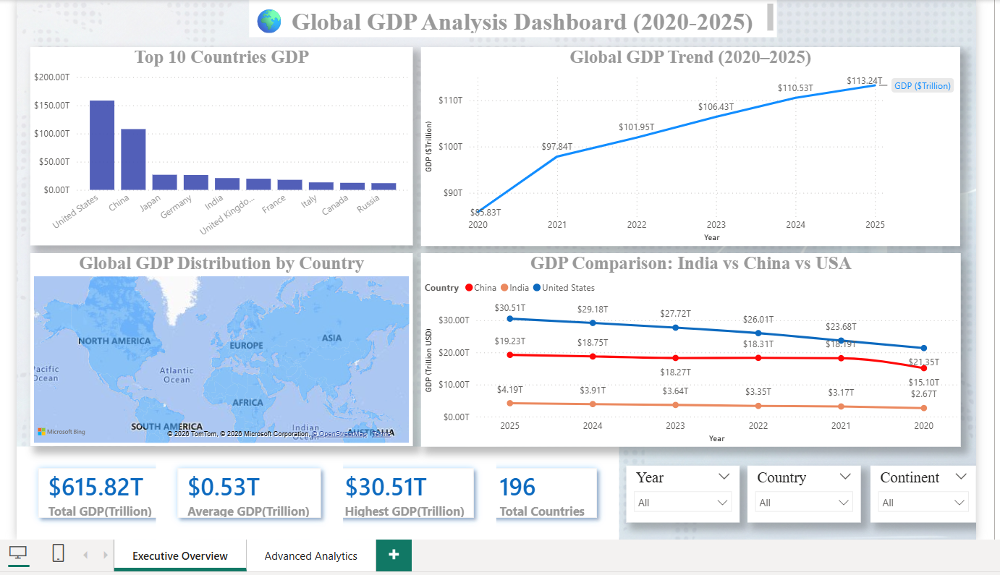
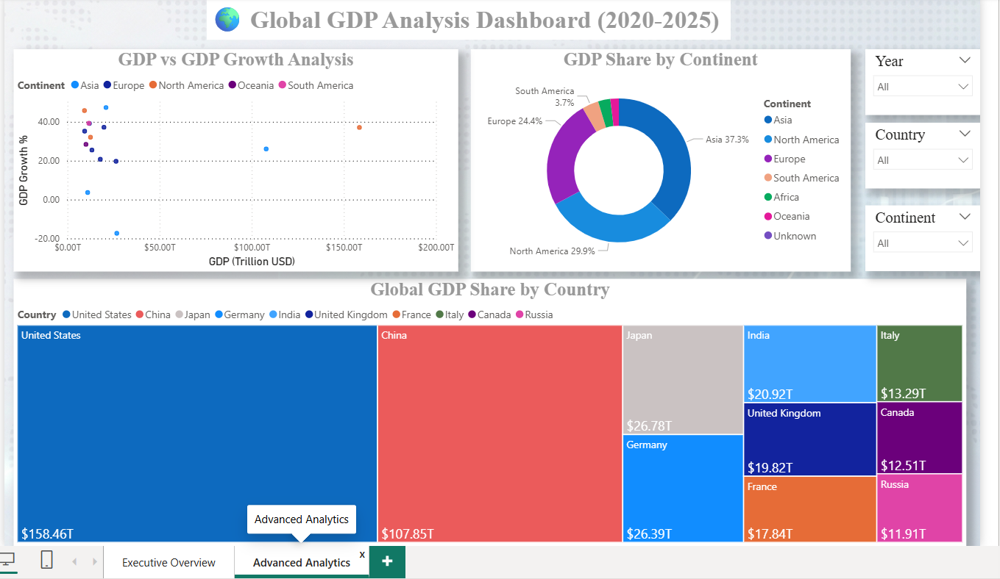

# 🌍 Global GDP Analysis Dashboard

## 📌 Project Overview

This project analyzes global GDP trends (2020–2025) using Power BI, Python, SQL, and PostgreSQL.

The dashboard provides insights into:
- country-wise GDP
- GDP growth trends
- continent analysis
- global economic performance

---

## 🚀 Tools & Technologies

- Power BI
- Python
- SQL
- PostgreSQL
- Pandas
- Matplotlib

---

## 📊 Dashboard Features

- KPI Cards
- Top 10 GDP Countries
- Global GDP Trend
- Interactive World Map
- Donut Chart
- Treemap
- Scatter Plot
- Interactive Filters & Slicers

---

## 📷 Dashboard Preview

 

## 📌 Skills Demonstrated

- Data Analytics
- Data Cleaning
- Data Visualization
- Dashboard Design
- SQL Integration
- Business Intelligence
